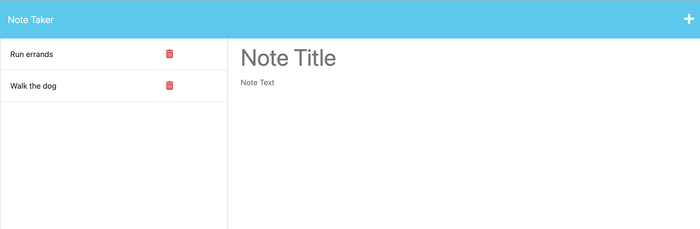

#  Note Taker App
  
  ## Licensing: MIT 

  ## Description
    This application will use an Express.js back end and will save and retrieve note data from a JSON file.  The use will be able to post new notes as well as delete notes. Upon refresh, the user will also be able to see their previous notes stored on the left hand side of the app.
  ## Table of Contents
  
  -[Installation](#installation)
  -[Usage](#usage)
  -[Credits](#credits)
  -[License](#license)  
  -[Tech used](#tech-used)

  ## Installation
    There is no need to install anything for this app to function. This app will be deployed using Heroku.

    Deployed Heroku URL: https://note-taker-app-express-6d24a8e12696.herokuapp.com/
  ## Usage
  
    The user simply needs to add a note using the + icon on the top right of the screen. To delete not that has alrready been posted, the use can
    click on the trash can icon to delete the note.

  
  ## Tech used
  * JavaScript
  * Node.JS
  * Express

  ## Credits
  
  - Collaborators: N/A

  ## Questions
  Have any questions or concerns? Here is where you can reach me:
  - Github: alugo0823
  - Email: lugo.kse23@gmail.com
  
  ## Screenshot
  